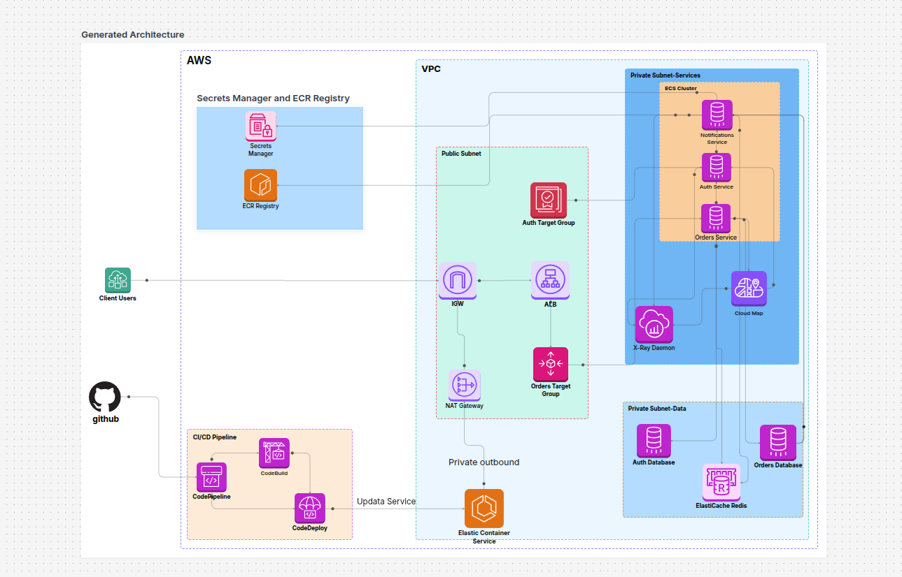
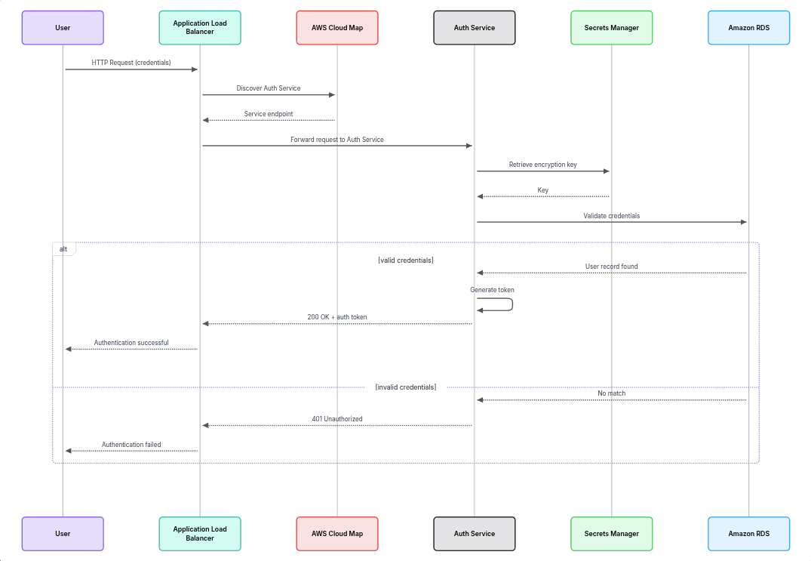

# Project 6: Containerized Microservices with ECS Fargate and Service Discovery

**Architecture Category:** Containers
**Author:** Salah Said

## Description

Migration of a monolithic Node.js application into three independent
microservices — **Auth**, **Orders**, and **Notifications** — running on
Amazon ECS Fargate. Services communicate with each other via **AWS Cloud
Map** for DNS-based service discovery, while external traffic is routed
through an **Application Load Balancer** with path-based routing. Secrets
(DB credentials, API keys) are stored in **AWS Secrets Manager** and
injected into containers at runtime rather than hardcoded. **CodePipeline**
and **CodeDeploy** run blue/green deployments with automatic rollback on
failure, and **ElastiCache Redis** provides a shared session store across
stateless container instances.

## Architecture Diagram



- **Public Subnet**: Internet Gateway, NAT Gateway, ALB, Target Groups
- **Private Subnet – Services**: ECS Cluster (Auth/Orders/Notifications
  services), Cloud Map, X-Ray Daemon
- **Private Subnet – Data**: Auth DB, Orders DB (RDS), ElastiCache Redis
- **Secrets Manager & ECR Registry**: centralized secrets + private image
  registry with scan-on-push
- **CI/CD Pipeline**: GitHub → CodePipeline → CodeBuild → CodeDeploy →
  ECS (blue/green)

## Authentication Flow

The sequence diagram below shows how a login request flows through the system — from the ALB, through Cloud Map service discovery, to the Auth Service validating credentials against RDS.




## Key AWS Services

| Service | Role in this architecture |
|---|---|
| **ECS Fargate** | Runs the 3 microservices as serverless containers — task definitions, services, capacity providers |
| **ECR** | Private container registry per service, with vulnerability scanning on push |
| **ALB + Target Groups** | Path-based routing to microservices (e.g. `/api/orders/*`, `/api/auth/*`) |
| **AWS Cloud Map** | Service discovery — containers find each other via DNS (`auth.ecs-microservices.local`) |
| **Secrets Manager** | Injects DB credentials and app secrets into containers at runtime |
| **ElastiCache (Redis)** | Shared session cache across stateless container instances |
| **CodePipeline + CodeDeploy** | CI/CD with blue/green deployment and automatic rollback |
| **X-Ray** | Distributed tracing across all three microservices with a service map |

## Learning Outcomes

- Built and pushed Docker images to ECR, configured ECS task definitions
- Designed ECS Fargate services with correct IAM task roles and execution roles
- Implemented service-to-service communication using Cloud Map DNS-based discovery
- Configured ALB path-based routing rules to front multiple microservices
- Set up blue/green deployments using CodeDeploy with ECS integration
- Managed secrets securely with Secrets Manager, avoiding hardcoded credentials

## Repository Structure

```
versions.tf, variables.tf          provider + inputs
vpc.tf, security_groups.tf         networking (public/private-services/private-data subnets)
ecr.tf                             3 ECR repos (scan on push)
secrets.tf                         Secrets Manager (db creds + app secrets)
rds.tf, elasticache.tf             Auth/Orders Postgres + shared Redis
alb.tf                             ALB, blue/green target groups, path rules
cloudmap.tf                        service discovery namespace
iam.tf                             execution role + per-service task roles
ecs.tf                             cluster, task defs (+ X-Ray sidecar), services
artifacts.tf                       S3 bucket for pipeline artifacts
codebuild.tf, codedeploy.tf,
codepipeline.tf                    CI/CD per service
services/<name>/                   app code, Dockerfile, buildspec.yml, taskdef.template.json, appspec.yml
docs/architecture-diagram.png      solution architecture diagram
```

## Deployment

### 1. Prerequisites
- AWS account + AWS CLI configured
- Terraform >= 1.6.0
- A CodeStar Connection to GitHub (create once via AWS Console → Developer
  Tools → Settings → Connections)

### 2. Deploy the infrastructure
```bash
cp terraform.tfvars.example terraform.tfvars   # fill in real values
terraform init
terraform plan
terraform apply
```

### 3. Fill in task role ARNs
After the first `terraform apply`, run:
```bash
terraform output ecs_execution_role_arn
terraform output ecs_task_role_arns
```
Paste those into `services/auth/taskdef.template.json` and
`services/orders/taskdef.template.json`, then push — this triggers the
CodePipeline for each service automatically.

### 4. Verify
```bash
curl http://<alb_dns_name>/api/auth/register \
  -X POST -H "Content-Type: application/json" \
  -d '{"email":"test@test.com","password":"123456"}'
```

## Notes

- `notifications` is internal-only (no ALB rule) — reachable only via Cloud
  Map at `notifications.ecs-microservices.local`, and deploys via plain ECS
  rolling update rather than blue/green.
- `auth` and `orders` use CodeDeploy blue/green with two target groups
  (blue/green) each; Terraform stops managing `task_definition` and
  `load_balancer` on the ECS service after first apply so CodeDeploy can
  own deployments going forward.
- X-Ray daemon runs as a sidecar in every task (UDP 2000); each service's
  X-Ray SDK sends segments to `127.0.0.1:2000`.
- RDS and ElastiCache are single-AZ / single-node to keep this a learning
  build — add `multi_az = true` and Redis replicas for production use.
- DB credentials are injected as environment variables at task startup via Secrets Manager. The encryption key used to sign auth tokens is fetched via a runtime API call to Secrets Manager on each authentication request.
